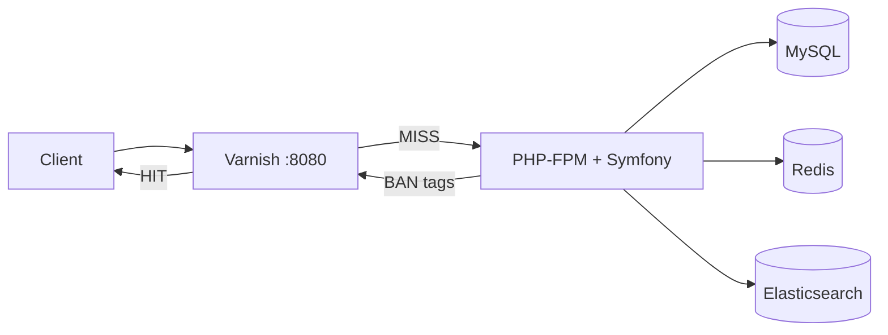
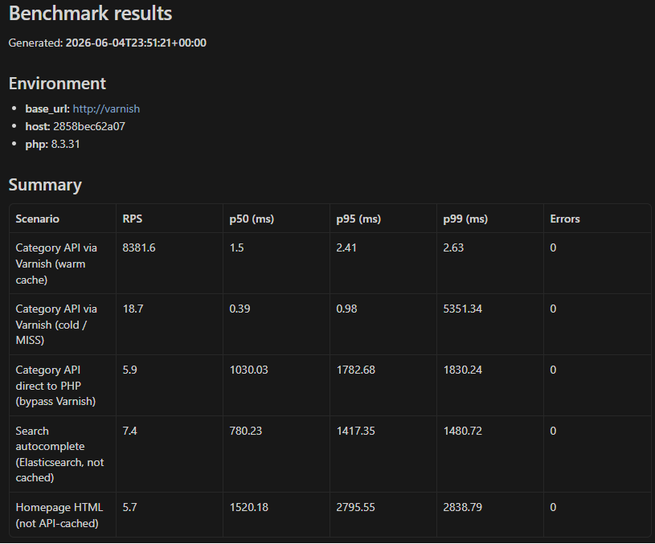
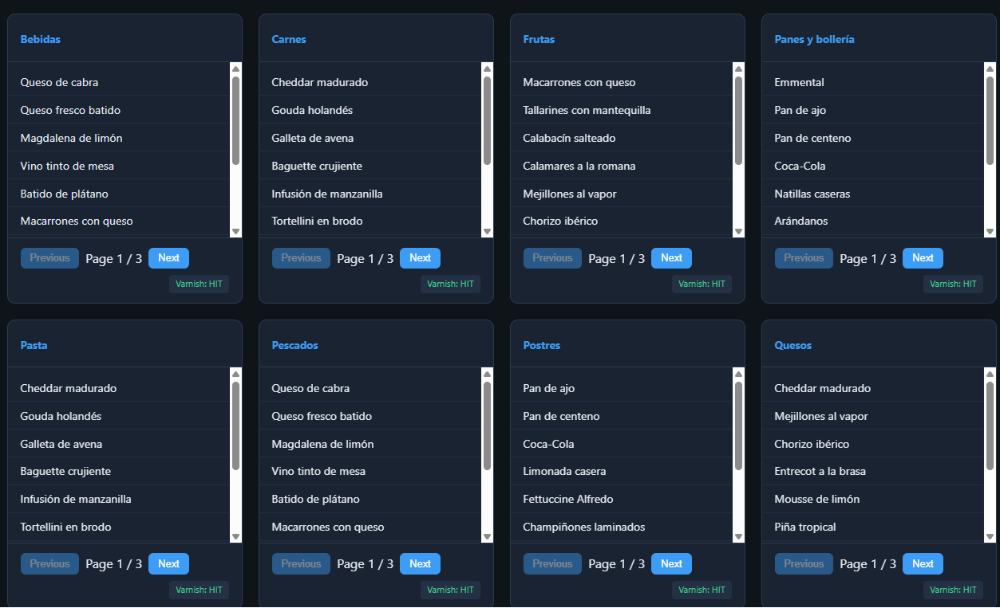
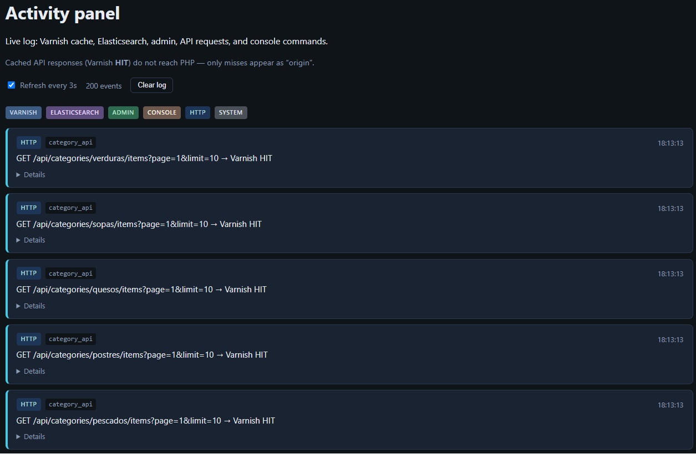
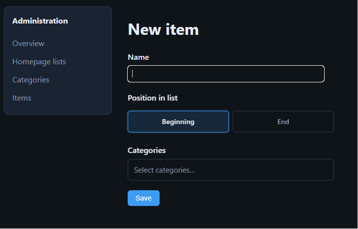

# Benchmark List


Symfony load benchmark: **Varnish** edge cache, **Redis**, **Elasticsearch**, and tag-based invalidation on JSON list APIs.

## Quick start

**Requirements:** [Docker Desktop](https://www.docker.com/products/docker-desktop/) (or Docker Engine + Compose)

```bash
git clone https://github.com/ALGDGit/Benchmark-List.git
cd Benchmark-List

docker compose up -d --build

docker compose exec -u www-data web php bin/console doctrine:migrations:migrate --no-interaction
docker compose exec -u www-data web php bin/console app:seed-database --force
docker compose exec -u www-data web php bin/console app:index-elasticsearch --reset
```

| URL | Purpose |
|-----|---------|
| http://localhost:8080 | Public site (via Varnish) |
| http://localhost:8081 | Direct PHP/nginx (bypass Varnish) |
| http://localhost:8080/admin | Admin CRUD |
| http://localhost:8080/panel | Activity / cache log |

If you get **503 Backend fetch failed**, wait until `web` is healthy, then `docker compose restart varnish`.

## Architecture



Details: [docs/ARCHITECTURE.md](docs/ARCHITECTURE.md) · [docs/DECISIONS.md](docs/DECISIONS.md)

## Benchmark results

Docker Desktop (Windows), 10 categories × 25 items. Reports: [`benchmarks/results/latest.md`](benchmarks/results/latest.md) · [`benchmarks/results/latest.json`](benchmarks/results/latest.json)

| Scenario | RPS | p50 (ms) | p95 (ms) | p99 (ms) |
|----------|-----|----------|----------|----------|
| Category API via Varnish (warm cache) | 8382 | 1.5 | 2.4 | 2.6 |
| Category API via Varnish (cold / MISS) | 19 | 0.4 | 1.0 | 5351* |
| Category API direct to PHP (bypass Varnish) | 6 | 1030 | 1783 | 1830 |
| Search autocomplete (Elasticsearch) | 7 | 780 | 1417 | 1481 |
| Homepage HTML | 6 | 1520 | 2796 | 2839 |

\*Cold scenario: high p99 from first MISS under concurrent load; mean latency ~268 ms.



```bash
./benchmarks/run.sh          # Linux / macOS / Git Bash
.\benchmarks\run.ps1         # Windows PowerShell
```

Scenarios are defined in [`benchmarks/scenarios.json`](benchmarks/scenarios.json).

## Screenshots







## Stack

| Layer | Technology |
|-------|------------|
| Framework | Symfony 7.2, PHP 8.3, Doctrine ORM 3 |
| Edge cache | Varnish 7.5 (tag BAN, 1h TTL on API) |
| App cache / log | Redis 7 |
| Database | MySQL 8 |
| Search | Elasticsearch 8.15 |
| Runtime | Docker Compose |

## Configuration

| Variable | Default | Effect |
|----------|---------|--------|
| `FEATURE_ELASTICSEARCH` | `1` | `0` disables search API (503) |
| `FEATURE_REDIS_ACTIVITY` | `1` | `0` uses file-based activity log |

Set in `.env` or `docker-compose.yml`, then restart `web`.

## Development

```bash
make setup
composer test
docker compose exec -u www-data web php bin/console ...
```

CI (`.github/workflows/ci.yml`): PHPUnit, Docker smoke test, optional benchmark job via **workflow_dispatch**.

## License

Proprietary.
