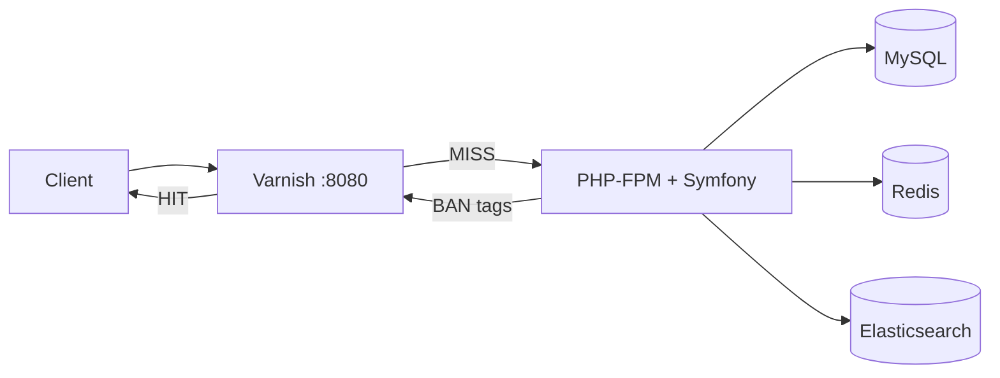

# Benchmark List


**Performance benchmark** comparing cache and search layers under load in a Symfony application.

> Benchmark de rendimiento bajo carga comparando configuraciones de **caché HTTP (Varnish)**, **Redis** (Symfony + activity log) y **búsqueda (Elasticsearch)** en Symfony.

## What this project demonstrates

- **Edge caching** with Varnish on JSON list APIs (`/api/categories/...`, `/api/lists/...`)
- **Tag-based invalidation** (BAN) when admin changes items — full list vs last-page-only
- **Observable cache behavior** — `X-Cache: HIT|MISS` in the UI + activity panel
- **Automated HTTP benchmarks** with JSON/Markdown reports
- **Feature toggles** to disable Elasticsearch or Redis for A/B comparisons

## Architecture



Full details: [docs/ARCHITECTURE.md](docs/ARCHITECTURE.md) · Design choices: [docs/DECISIONS.md](docs/DECISIONS.md)

## Quick start

**Requirements:** [Docker Desktop](https://www.docker.com/products/docker-desktop/) (or Docker Engine + Compose)

```bash
git clone https://github.com/ALGDGit/Benchmark-List.git
cd Benchmark-List

docker compose up -d --build

docker compose exec -u www-data web php bin/console doctrine:migrations:migrate --no-interaction
docker compose exec -u www-data web php bin/console app:seed-database --force
docker compose exec -u www-data web php bin/console app:index-elasticsearch --reset
```

| URL | Purpose |
|-----|---------|
| http://localhost:8080 | Public site (**via Varnish**) |
| http://localhost:8081 | Direct PHP/nginx (**bypass Varnish**) |
| http://localhost:8080/admin | Admin CRUD (items, categories, slots) |
| http://localhost:8080/panel | Activity / cache log |

If you see **503 Backend fetch failed**, wait until `web` is healthy, then `docker compose restart varnish`.

## Benchmark results

Sample run (Docker Desktop, 10 categories × 25 items, concurrency 20). **Re-run on your machine** for accurate numbers:

| Scenario | RPS | p50 (ms) | p95 (ms) | p99 (ms) |
|----------|-----|----------|----------|----------|
| Category API via Varnish (warm) | ~800–1200 | ~10–20 | ~25–40 | ~50–80 |
| Category API direct (no Varnish) | ~50–150 | ~80–200 | ~300–600 | ~800+ |
| Search autocomplete (Elasticsearch) | ~80–200 | ~40–80 | ~120–200 | ~250+ |
| Homepage HTML | ~200–400 | ~30–60 | ~80–120 | ~150+ |

Committed reports: [`benchmarks/results/latest.md`](benchmarks/results/latest.md) · [`benchmarks/results/latest.json`](benchmarks/results/latest.json)

### Run benchmarks

```bash
./benchmarks/run.sh          # Linux / macOS / Git Bash
.\benchmarks\run.ps1         # Windows PowerShell

# or manually
docker compose exec -u www-data web php bin/console app:benchmark --all --base-url=http://varnish
```

See [docs/BENCHMARKS.md](docs/BENCHMARKS.md) for scenarios, Apache Bench, and comparison matrix.

## Cache invalidation demo

1. Open homepage — list cards show **Varnish: HIT** after first load.
2. Admin → create item at **Beginning** → full category cache purged.
3. Create item at **End** → only **last page** tag purged.
4. `/panel` shows `BAN Varnish cache tag(s): ...` entries.


## Stack

| Layer | Technology |
|-------|------------|
| Framework | Symfony 7.2, PHP 8.3, Doctrine ORM 3 |
| Edge cache | Varnish 7.5 (tag BAN, 1h TTL on API) |
| App cache / log | Redis 7 (Symfony cache pool + activity log) |
| Database | MySQL 8 |
| Search | Elasticsearch 8.15 (autocomplete) |
| Runtime | Docker Compose |

## Feature flags

Set in `.env` or `docker-compose.yml`:

| Variable | Default | Effect |
|----------|---------|--------|
| `FEATURE_ELASTICSEARCH` | `1` | `0` disables search API (503) |
| `FEATURE_REDIS_ACTIVITY` | `1` | `0` uses file-based activity log |

Example override: [docker-compose.override.example.yml](docker-compose.override.example.yml)

## Development

```bash
make setup          # up + migrate + seed + index
make logs
composer test       # PHPUnit (unit tests)
composer benchmark  # inside container with DEFAULT_URI set
```

Console commands must run as `www-data` in Docker:

```bash
docker compose exec -u www-data web php bin/console ...
```

## Tests & CI

- **PHPUnit** unit tests: `CacheTag`, benchmark stats, enums
- **GitHub Actions** (`.github/workflows/ci.yml`):
  - `test` — PHPUnit on PHP 8.3
  - `docker-smoke` — full stack + API smoke test
  - `benchmark` — runs `./benchmarks/run.sh` (manual dispatch / master)

## Project structure

```
benchmarks/          Scenarios, run scripts, results (JSON/MD)
docker/              PHP, Varnish VCL, nginx
docs/                Architecture, decisions, benchmark guide
src/Service/         VarnishPurger, CacheTag, Benchmark runner
tests/               PHPUnit unit tests
```

## API endpoints (cache-relevant)

| Method | Path | Varnish |
|--------|------|---------|
| GET | `/api/categories/{slug}/items?page&limit` | Cached |
| GET | `/api/lists/{1-10}?page&limit` | Cached |
| GET | `/api/search/autocomplete?q` | Pass |
| GET | `/api/activity` | Pass |

## License

Proprietary — portfolio / demo project.

## Links

- Repository: https://github.com/ALGDGit/Benchmark-List
- [Architecture](docs/ARCHITECTURE.md)
- [Technical decisions](docs/DECISIONS.md)
- [Benchmark guide](docs/BENCHMARKS.md)
