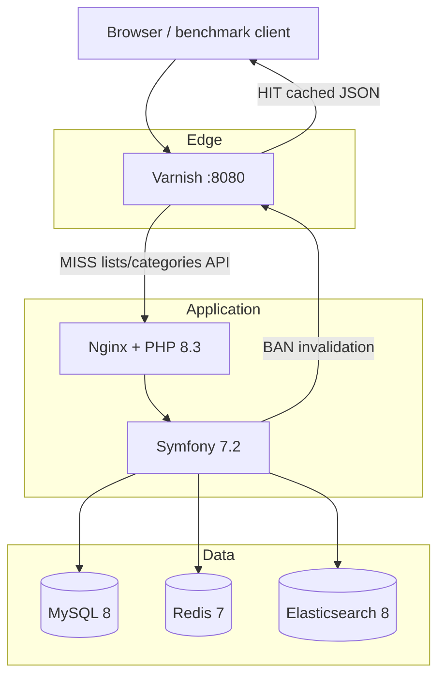
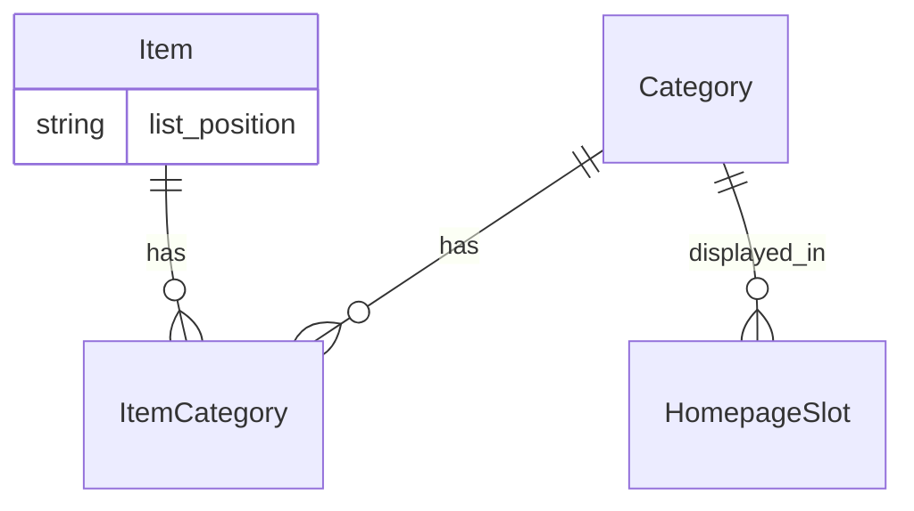

# Architecture

## Goal

Measure how Symfony behaves under load when caching and search layers are enabled or bypassed. The stack mirrors a typical production setup: **Varnish → PHP-FPM → MySQL**, with **Redis** (Symfony + activity log) and **Elasticsearch** (autocomplete).

## Request flow



## What gets cached

| Path | Varnish | Notes |
|------|---------|-------|
| `GET /api/categories/{slug}/items` | Yes | Homepage lists; tag-based TTL 1h |
| `GET /api/lists/{slot}` | Yes | Slot API (same tags as category) |
| `GET /api/search/autocomplete` | No | Always hits PHP + ES |
| HTML pages, admin, activity | No | `return (pass)` in VCL |

## Cache tags

Each cached API response includes:

```http
X-Cache-Tags: #category-sopas#category-sopas-page-1#
Cache-Control: public, max-age=0, s-maxage=3600
```

- `max-age=0` — browser always revalidates (UI can read `X-Cache`).
- `s-maxage=3600` — Varnish stores for 1 hour until **BAN**.

Invalidation is sent from `VarnishPurger` via HTTP `BAN` + `X-Ban-Tag`. See [DECISIONS.md](DECISIONS.md).

## Direct vs Varnish

| Port | Target | Use |
|------|--------|-----|
| **8080** | Varnish | Public URL; cached API |
| **8081** | PHP/nginx direct | Benchmark “no Varnish” scenario |

## Observability

- **`/panel`** — activity log (Redis list `benchmark:activity`, file fallback).
- **`X-Cache: HIT|MISS`** on API responses.
- **`POST /api/activity/cache-hit`** — browser reports Varnish HITs (PHP never sees cached responses).

## Domain model (simplified)



Items can belong to many categories. `list_position` (`first` | `last`) controls sort order and **how much cache is purged** on admin changes.
